# Extraction pipeline — screenshot to reviewable candidate

**Type:** Pipeline / flowchart
**Shows:** every stage between an uploaded screenshot and a candidate in the review pass, and where each guarantee is enforced.
**Traces to:** REQ-008, REQ-009, REQ-010, REQ-012, REQ-058, REQ-071, REQ-074, NFR-012, **NFR-012a**, NFR-020; OQ-005, OQ-013, OQ-015, OQ-024
**Revised:** 2026-08-11T11:50 — **R7 / A45 / ADR-0009: TWO ingest affordances (clipboard paste + file upload) converge on ONE pre-stage; the HEIC transcode is now CONDITIONAL on the sniffed type (ADR-0008 Rev 3)**
**Prior revision:** 2026-08-11T10:05 — R5 / ADR-0008: images entering Stage 1 are post-transcode PNG/JPEG (HEIC/HEIF transcoded to lossless PNG at ingest, upstream of this pipeline)
**Prior revision:** 2026-08-10T21:07 — ADR-0001 Revision 2 (hybrid extraction)

```mermaid
flowchart LR
    paste[/"PASTE (primary — A45)<br/>desktop: paste event (Ctrl/Cmd+V)<br/>iOS 13.4+: 'Paste screenshot' button<br/>→ navigator.clipboard.read()<br/>ALWAYS image/png · HTTPS required<br/>EXIF already stripped by WebKit"/]
    upload[/"FILE UPLOAD (RETAINED — the floor)<br/>laptop save-then-upload · iOS Photos<br/>PNG · JPEG · HEIC/HEIF<br/>EXIF/GPS INTACT — REQ-078 strip REQUIRED here"/]
    upl[/"ONE ingest pipeline · ADR-0008 Rev 3 / ADR-0009<br/>magic-byte sniff (never the declared type)<br/>pre-decode pixel guard (A43-M1) — ALL paths<br/>transcode IFF sniffed HEIC/HEIF → LOSSLESS PNG<br/>strip EXIF/GPS · clamp dims · then write blob"/]
    img[/"Stored screenshot<br/>PNG or JPEG (post-transcode), private blob"/]

    subgraph extract["Stage 1 — extraction (behind the TitleExtractor interface) · ADR-0001 Rev 2"]
        llm["Azure OpenAI gpt-4.1<br/>multimodal vision — PRIMARY<br/>strict JSON Schema"]
        ocr["Azure AI Vision<br/>Read OCR — F0<br/>MANDATORY CROSS-CHECK"]
        merge["crossCheck() — pure, deterministic<br/>• support: exact / partial / none<br/>• OCR orphan recovery (REQ-012)<br/>• geometry + total ordering"]
        lines["ExtractedTextItem[]<br/>rawText · inferredTitle · basis<br/>ocrSupport · boxes"]
    end

    subgraph clean["Stage 2 — deterministic clean-up (our code)"]
        order["Group by reading order<br/>ocr-only items only"]
        filt["Reject chrome, headings,<br/>durations, badges<br/>ocr-only items only"]
        norm["Normalise text<br/>matchText = inferredTitle ?? rawText"]
        dedup["Collapse intra-batch<br/>scroll overlap — OQ-013"]
    end

    subgraph identify["Stage 3 — identity (deterministic, never model-assisted)"]
        search["TMDB search<br/>by normalised title"]
        matched{"matched?"}
        wid["workIdentity =<br/>tmdb:type:id"]
        fallback["workIdentity =<br/>unmatched:hash<br/>ADR-0007 · OQ-015"]
    end

    subgraph gate["Stage 4 — suppression gate"]
        supp{"suppression record<br/>for this workIdentity?"}
        drop["DROPPED — never created,<br/>never shown (REQ-071)"]
    end

    subgraph review["Stage 5 — classification and review"]
        classify["Classify: new vs<br/>already-present-for-this-service"]
        pass[/"Review pass —<br/>NOTHING is silently discarded (REQ-012)"/]
    end

    img --> llm --> merge
    img --> ocr --> merge
    paste --> upl
    upload --> upl
    upl --> img
    merge --> lines --> order --> filt --> norm --> dedup --> search --> matched
    matched -->|yes| wid
    matched -->|no| fallback
    wid --> supp
    fallback --> supp
    supp -->|yes| drop
    supp -->|no| classify --> pass

    reextract["Re-extraction (REQ-074)<br/>within the 30-day window"] -.->|"re-runs the whole pipeline"| llm

    classDef ai fill:#f3e8fd,stroke:#9334e6
    classDef danger fill:#fdecea,stroke:#c5221f
    class llm,ocr ai
    class drop,fallback danger
```

## Explanation

**A pre-stage sits upstream of Stage 1, and at R7 it has TWO entrances and
ONE pipeline (`A45`, ADR-0009).** The owner's expected interaction is
*"take a screen grab and paste it into the app directly"*, so ingest is
reachable by **clipboard paste** — a document-level `paste` listener on
desktop (Ctrl/Cmd+V, no prompt) and a visible **"Paste screenshot" button**
calling `navigator.clipboard.read()` on iOS 13.4+ (the only verified iOS
path) — **and** by **file upload, which is RETAINED and fully supported**.
Upload is the only route for the laptop save-then-upload case and the iOS
Photos case, and therefore **the only route by which raw HEIC arrives at
all**. Both entrances land on the same sniff → guard → transcode → strip →
store sequence; there is one validator, not two.

Ingest
accepts **PNG, JPEG and HEIC/HEIF** (decided by magic bytes, never by the
declared content type and never by the `ClipboardItem` type string).
Because **neither reader accepts HEIC/HEIF** —
Azure OpenAI vision takes PNG/JPEG/WEBP/non-animated GIF and Azure AI
Vision Read takes JPEG/PNG/GIF/BMP/WEBP/ICO/TIFF/MPO — a HEIC/HEIF image
is **transcoded to lossless PNG at ingest** (`heic-convert`, WASM
`libheif-js`, decode-only), with **EXIF/GPS stripped** and the raster
clamped to the Read dimension bounds, **before the blob is written**.
Lossless, never a lossy re-encode, is mandated by `NFR-012a` so the tile
captions and artwork this pipeline reads are not degraded. Every image
entering Stage 1 is therefore already PNG or JPEG; the readers never see
HEIC.

⚠ **R7: the transcode is CONDITIONAL on the sniffed type — it runs iff the
sniff says HEIC/HEIF.** ~~It runs on every ingested image.~~ A pasted
screenshot is **always `image/png`** (WebKit exposes exactly four clipboard
representations, and HEIC is not one of them), so the paste path takes the
skip branch. **That is a consequence of a verified platform fact, not an
optimisation**, and the branch must key on the **sniff result, never on the
ingest source** — the stage is **not removed**, because the Photos upload
path still delivers raw HEIC (ADR-0008 Rev 3). The **pre-decode pixel guard
applies to pasted images exactly as it does to uploaded ones**; nothing is
trusted because of how it arrived.

⚠ **The EXIF asymmetry.** WebKit strips EXIF on **clipboard read** but
**not** on **file upload**. `REQ-078`'s explicit, tested strip therefore
stays on the **upload** path and stays mandatory — the paste path's free
stripping covers one of the two entrances only, and `T-SEC-032` asserted
against a pasted image would pass vacuously.

(The transcode is memory-hungry on the 0.5 GiB container — see
`architecture.md` §Cost summary / `RSK-016`. **R7 reduces how often it
runs, not how severe it is; `A43-M1`…`M5` remain mandatory.**)

**Stage 1 holds the product's only inference, and after ADR-0001
Revision 2 it holds two calls, not one.** The **primary reader** is a
multimodal model (`gpt-4.1`) that sees a tile grid as tiles: it groups a
title with its artwork natively, completes captions the UI truncated,
and — the reason the decision changed — **identifies works from box
artwork with no legible text**, which is what dropped `RSK-021` from
High to Low. The **cross-check reader** is the Revision 1 OCR engine, on
the free F0 tier, and it runs on **every** image. `NFR-012a` (from A40)
exempts extraction from near-zero cost and puts **quality above cost**
here; the result is ~$0.50–$0.70/month, of which the cross-check is $0.

**The cross-check is not redundancy, it is the safety mechanism.**
Revision 1 chose OCR because its failures are *visible* — a garbled
string, a dropped line — whereas a model's failures are *fluent,
plausible and confident*. Revision 2 keeps that property rather than
trading it away. `crossCheck()` is a pure, deterministic function that
does two things the review pass depends on: it marks every model title
with **no** corroborating OCR text as `inferred-unverified` (shown with
its tile thumbnail, so verification is a glance), and it **recovers as a
candidate any OCR line the model failed to report** — so the model
cannot silently omit a title. That second direction is a `REQ-012`
guarantee Revision 1's single-provider design could not offer at all.

**Stage 1 is also the only stage behind an interface.** `US-006 AC-1`
mandates the `TitleExtractor` boundary so the provider decision stays
reversible in hours. Reverting to Revision 1's OCR-only behaviour is one
configuration value (`NEXTUP_EXTRACTOR=azure-vision-read`). The provider
names must not appear anywhere outside their own modules and
configuration.

**Stage 2's hand-written filtering is now a secondary path.** Reading-
order grouping and the 26-term chrome vocabulary apply **only** to
`ocr-only` orphans; the primary reader returns one item per tile and is
instructed not to report chrome at all. Those heuristics — and their
three uncalibrated constants — are no longer load-bearing. **Every
filter is still a place where a real title could be silently dropped,
and `REQ-012` still forbids that**: classify and surface, never drop and
hide. That rule now applies to the model's output too.

**Stage 3 is deliberately deterministic, for two reasons.** The first is
correctness — a model-assisted matcher's failure mode is a fluent,
plausible, *wrong* work, which is the silent-error class this project
consistently refuses. The second is compliance: TMDB's API terms restrict
use "in connection with … a machine learning (ML) or artificial
intelligence (AI) based Application", and the reading this architecture
adopts is that **no TMDB content may ever be transmitted to any AI or
vision service** (`RSK-022`, ADR-0001). ⚠ **That rule binds TMDB
content, not the owner's screenshot pixels** (ADR-0001 R2.4) — it is not
a prohibition on vision extraction. The pipeline's shape enforces it
either way: the readers see only the owner's own screenshot; TMDB is
reached only afterwards, by string search. The two never meet. Stage 3
also acts as an independent plausibility filter on the model's output —
a fabricated title still has to match a real work.

**Stage 4 is placed where it is on purpose.** The suppression check
happens **after** identity is resolved and **before** anything is created
or shown — which is exactly what `REQ-071` requires ("MUST test each
extracted candidate against the set of suppressed work identities before
creating any title or service listing for it"). Because the suppression
record's key is derived from `workIdentity` (ADR-0005), this is a single
point-read, not a query. Moving this gate later — say, filtering
suppressed items out of the review UI — would appear to work and would
silently fail on the very next capture, because a confirmed candidate
would create a new row.

**The `unmatched:hash` fallback is marked as a hazard, and it is one.**
Its identity is only as stable as the OCR output: one character of
variance splits one work into two identities, producing a visible
duplicate row (tolerable — the owner sees it) and an **invisible**
suppression bypass. This is the acknowledged residual of `OQ-015`, which
remains **open**; `ADR-0007` is a recommendation to `spec-writer`, not a
closure. `REQ-066` fix-match is the repair path: re-pointing an unmatched
title at a TMDB work replaces the fallback identity with a canonical one.

**`REQ-058` is enforced by the shape of the pipeline, not by a rule.**
No stage produces a service value. The service comes from the owner's
batch selection and nowhere else, and the extractor's return type has no
field it could occupy — so service inference is not disabled, it is
absent.

**Re-extraction re-runs the whole pipeline**, not just OCR (REQ-074), and
its results enter through the normal review pass, preserving `REQ-013`'s
no-silent-write guarantee. It works for as long as the images are
retained — 30 days (`NFR-019`) — which is why it is only a **partial**
substitute for the mixed-changeset batch undo deferred at A36.

## Notes and caveats

- **The largest open risk in the architecture lives at Stage 1**
  (`RSK-021` / `OQ-024`): if the owner's capture surface renders titles
  as **box artwork** rather than as text, OCR produces few or no
  candidates. This is an accuracy question, not a cost question — the
  escalation to a multimodal LLM behind the same interface is priced at
  under $1/month, so `NFR-012` survives it. The owner can settle it in
  about ten minutes by capturing one screenshot per service.
- Failure handling is omitted: an unavailable extractor puts the batch in
  `extraction failed` with images retained and a retry offered
  (US-006 AC-4); an unreachable TMDB marks candidates unmatched rather
  than discarding them (US-007 AC-5). **No failure may change list
  state.**
- The manual-entry fallback (US-006 AC-5) bypasses stages 1–3 entirely:
  the owner searches TMDB and adds the work directly to the batch's
  additions.
- Stage 2's specific heuristics are owed to `specs/ai.md`. This diagram
  fixes the stage order and the guarantees, not the algorithms.
- No model is trained, fine-tuned or given feedback anywhere in this
  pipeline. No owner data is used for training.
