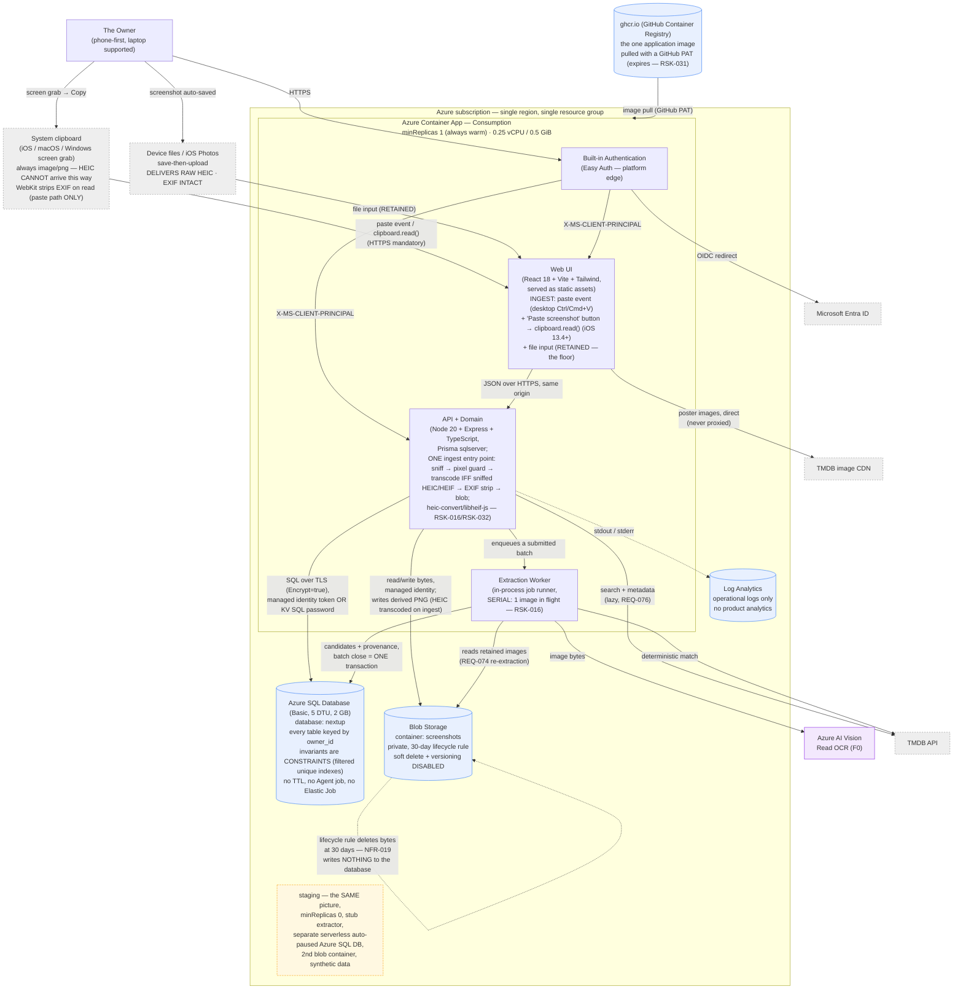

# Containers — nextup

**Type:** C4 Level 2 — container diagram
**Shows:** the deployable and runnable units, the data stores, and every trust boundary crossing.
**Traces to:** REQ-005, REQ-006, REQ-008, REQ-041, REQ-074, REQ-076, NFR-008, NFR-011, NFR-012, NFR-015, NFR-019, NFR-020

> ⚠ **REVISION 7 — TWO ingest affordances converge on ONE pipeline
> (`A45`, ADR-0009).** Redrawn. The **Web UI** now offers a **document-level
> `paste` listener** (desktop Ctrl/Cmd+V) **and** a **visible "Paste
> screenshot" button** calling `navigator.clipboard.read()` (the only
> verified iOS path, iOS 13.4+) — **in addition to `<input type="file">`,
> which is RETAINED and fully supported** (the only path for the laptop
> save-then-upload case and the iOS Photos case, and the only one that
> delivers raw HEIC). All three land on **one** ingest entry point in the
> **API + Domain** container: sniff → pixel guard → **transcode IFF sniffed
> HEIC/HEIF** → EXIF strip → blob write. **The transcode is now conditional
> on the sniffed type, not unconditional** (ADR-0008 Rev 3) — pasted images
> are always `image/png`. ⚠ **WebKit strips EXIF on clipboard read but NOT
> on file upload**, so `REQ-078`'s explicit strip stays on the upload path.
> HTTPS is a functional dependency of the clipboard APIs. Below R5 banner
> retained.

> ⚠ **REVISION 5 — HEIC transcode added at ingest (ASM-058 / A42).** The
> **API + Domain** container now transcodes HEIC/HEIF uploads to **lossless
> PNG on ingest** (`heic-convert`, WASM `libheif-js`, decode-only), strips
> EXIF/GPS, and writes the **derived PNG** to Blob Storage. Accepted formats
> at ingest are PNG + JPEG + HEIC/HEIF. New dependency, **LGPL-3.0 notice
> obligation** (no GPL `x265`). The transcode's WASM decode is the app's
> largest allocation and raises `RSK-016` OOM pressure on 0.5 GiB — see
> ADR-0008, `architecture.md` §Cost summary. Below R4 banner retained.

> ⚠ **REVISION 4 — owner selected Variant A (A40).** Redrawn again. Changed
> here from R3: **the owner data store is Azure SQL Database Basic, not
> PostgreSQL**; **the image comes from ghcr.io (PAT pull), not Azure
> Container Registry**; **compute is 0.25 vCPU / 0.5 GiB, not 0.5/1.0**; and
> **the extraction worker processes images serially** to contain OOM at the
> smaller size. Always-warm (`minReplicas = 1`) and staging both retained.
> Reasoning: ADR-0005 Rev 3, ADR-0003 Rev 3. Below R3 banner retained.

> ⚠ **REVISION 3 — 2026-08-10T21:45.** Redrawn after constraint change
> **A41/CC-002**. Changed here: **the owner data store is PostgreSQL, not
> Cosmos DB**; **the app is always warm (`minReplicas = 1`), not
> scale-to-zero**; **the image comes from Azure Container Registry**; and
> **a staging copy of this same picture now exists**. Reasoning: ADR-0005
> Rev 2, ADR-0003 Rev 2.

## Explanation

**One deployable.** The Web UI, the API and the extraction worker are
three logical components inside a **single container image** running as
one Azure Container App (ADR-0003). They are drawn separately because
they have genuinely different responsibilities, not because they deploy
separately. The single-deployable choice is driven by `NFR-002`/`NFR-004`
— the implementer is an autonomous coding agent and every additional
deployable is another thing to provision, authenticate, test and get
wrong. **R3: that reasoning did not depend on cost and is unchanged.**
`NFR-012`'s relaxation bought a warmer *single* container, not a
second one; **R4: the image now comes from ghcr.io, pulled with a GitHub
PAT — which reintroduces a registry secret and a quiet-expiry failure mode
(`RSK-031`) in exchange for the ~$5/mo ACR saving.**

**Authentication happens at the platform edge, before application
code.** Container Apps built-in authentication (ADR-0002) performs the
full OIDC flow with Entra ID and forwards a validated principal header.
No unauthenticated request reaches the UI or the API, which is
US-001 AC-1 enforced structurally rather than by a middleware someone
could forget. The application's own responsibility is the *allow-list*
check (NFR-017) and owner scoping (NFR-008) — authorisation, not
authentication.

**The value loop touches two things and no more, and neither of them is
asleep.** Opening the combined list is: browser → API → **Azure SQL
Database**. **R3/R4: the container is always warm (`minReplicas = 1`) and
Azure SQL Basic has no auto-pause** (only the serverless *staging* DB
pauses), so neither hop starts with a resume. This is
the direct answer to `SUC-001`: at one user nearly every session was a
cold session, so scale-to-zero was cheapest precisely where it was most
visible (`RSK-023`, now closed). **Poster images are loaded by the
browser directly from TMDB's image CDN and are never proxied**, so they
consume none of our compute and none of the request's latency budget. The
TMDB API edge from the API container is dashed in intent: under `REQ-076`
it fires only for rows being rendered whose stored metadata has passed
the 6-month `NFR-014` ceiling — normally nothing at all.

**Owner scoping is now a column, and the invariants are constraints.**
Every table carries `owner_id`, it leads every index, and it is the first
positional parameter of every repository function (`NFR-008`). **R3:
what used to be a partition-key *shape* plus a test is now, where it
matters, the database's own job** — at most one non-removed title per
`(owner_id, work_identity)` is a partial unique index, and suppression
uniqueness is a unique constraint. An invariant the store enforces cannot
be broken by an implementer who did not read the spec, which is worth
more here than in most projects (`NFR-002`, `RSK-016`).

**Extraction is deliberately off the request path.** Submitting a batch
returns immediately; the in-process worker reads the images from Blob
Storage, calls Azure AI Vision per image (ADR-0001), matches
deterministically against TMDB, and writes candidates plus reversal
provenance (REQ-068) to **Azure SQL Database**. The UI polls for
completion. Nothing
the worker writes is visible to the owner until the owner closes the
review pass. **R3: `REQ-005`/`REQ-006` are now enforced by a single
transaction** — the whole review pass commits or none of it does. The
Cosmos-era chunked-write/visibility-flag protocol, and the query
predicate every reader had to remember to include, are **deleted**
(ADR-0005 R2.3). That is the change with the largest effect on how easy
this system is to implement correctly.

**Screenshots are never publicly reachable.** The blob container has
public access and shared-key access both disabled; the API reads bytes
with a managed identity and streams them through an authenticated,
owner-scoped route. No blob URL and no SAS token is ever emitted to a
client — which is `NFR-020` satisfied by construction rather than by
configuration discipline (ADR-0006).

**Two ingest affordances, one pipeline (R7, `A45`, ADR-0009).** The owner's
stated interaction is *"take a screen grab and paste it into the app
directly"*, so the Web UI carries **both** clipboard primitives — a
document-level **`paste` event listener** for desktop Ctrl/Cmd+V (no
prompt, all four browsers) and a visible **"Paste screenshot" button**
calling `navigator.clipboard.read()` (the only *verified* path on iOS
13.4+, where WebKit shows a native per-invocation paste callout). ⚠ **File
upload is RETAINED, not replaced** — it is the only route for the laptop
save-then-upload case and for the iOS Photos case, and therefore the only
route that delivers **raw HEIC**. All three converge on **one** ingest
entry point in the API: sniff → pixel guard → transcode → strip → blob.
**HTTPS is a functional dependency**: `navigator.clipboard` is absent on
`http://`, so testing from the phone over a LAN IP silently removes both
clipboard affordances. The iOS Share Sheet is **not** an option — Web Share
Target is unimplemented in WebKit (bug 194593, NEW since 2019).

**HEIC/HEIF is transcoded to lossless PNG at ingest, CONDITIONALLY (R5;
R7, ADR-0008 Rev 3).**
Ingest accepts PNG, JPEG and HEIC/HEIF (magic bytes). Because neither
reader accepts HEIC and only Safari renders it, the API transcodes
HEIC/HEIF to **lossless PNG inside the synchronous ingest request, before
the blob is written**, strips EXIF/GPS, and stores the **derived PNG**.
**R7: the transcode runs *iff the sniffed type is HEIC/HEIF*** — pasted
images are always `image/png` (WebKit exposes only four clipboard
representations), so they take the skip branch. ⚠ **That skip is a
consequence of a verified platform fact, not an optimisation, and the
branch must key on the sniff result, never on the ingest source.** The
stage is **not removed**: the Photos upload path still delivers raw HEIC.
⚠ **WebKit strips EXIF on clipboard read but NOT on file upload**, so
`REQ-078`'s explicit, tested strip stays on the **upload** path and is not
delegated to the platform.
This is user-initiated work, **not a background process**, so it
does not touch `REQ-041`. The WASM decode is the container's largest
allocation; on 0.25 vCPU / 0.5 GiB it is contained by serial processing
and a mandatory pre-decode pixel guard, and is the live edge of `RSK-016`
— the priced remedy (1.0 GiB) is **pre-authorised and reactive**
(`runbooks/scale-up-memory.md`). **R7 changes how OFTEN the decode runs,
not how severe it is.** The new
dependency carries an **LGPL-3.0 notice obligation** (`RSK-032`,
decode-only, no GPL `x265`).

**The self-loop on Blob Storage is the only automatic deletion in the
entire product.** The 30-day purge (`NFR-019`) is a storage-service
lifecycle rule that deletes image bytes and touches nothing else. It is
drawn as a self-loop specifically to make visible that **no process
writes to the database on a timer** — the strongest available reading of
`REQ-041`'s closed enumeration. Availability of an image is *derived* by
the application from a `retain_until` value written once at upload.

## Notes and caveats

- **No queue, no scheduler, no cron, no Durable Functions, no
  `pg_cron`, no Azure SQL Agent job, no Elastic Job.** Their absence is a
  design decision, and **R3 re-tested it now that they are affordable;
  R4 restates it for Azure SQL**: `REQ-041` guarantees that only the
  owner changes user-visible list state, and the cheapest way to keep
  that guarantee is to have no scheduler in the deployment at all. At one
  user with a few uploads a month, an in-process worker is not a
  compromise.
- **A staging environment now exists** (shown as a note, not expanded —
  it is this same picture at `minReplicas = 0` with a stub extractor and
  synthetic data). **R4: staging is a separate serverless auto-paused
  Azure SQL database** (Azure SQL bills per DB, so ~$0.50/mo rather than
  the $0 the shared PG server gave), sharing only the storage account.
  Marginal cost ≈ $0.50. See ADR-0003 R3.3 and `deployment-diagram.md`.
  `RSK-025` stays Low.
- **Still one container app, one database, one storage account, one
  registry (now ghcr.io).** No HA replica, no read replica, no second
  region, no autoscaling rule, no VNet, no CDN, no WAF. The A41 relaxation
  was spent on *quality of the existing parts*, not on more parts.
- Log Analytics carries **operational** logs only — request outcomes,
  errors, extraction results. There is no client-side telemetry SDK and
  no product-usage event anywhere (`NFR-005`).
- GitHub Actions is omitted here; see `deployment-diagram.md`.
- Component-level internals of the API (routing, repository layer,
  middleware) are one level below this diagram and belong in
  `specs/api.md`.
