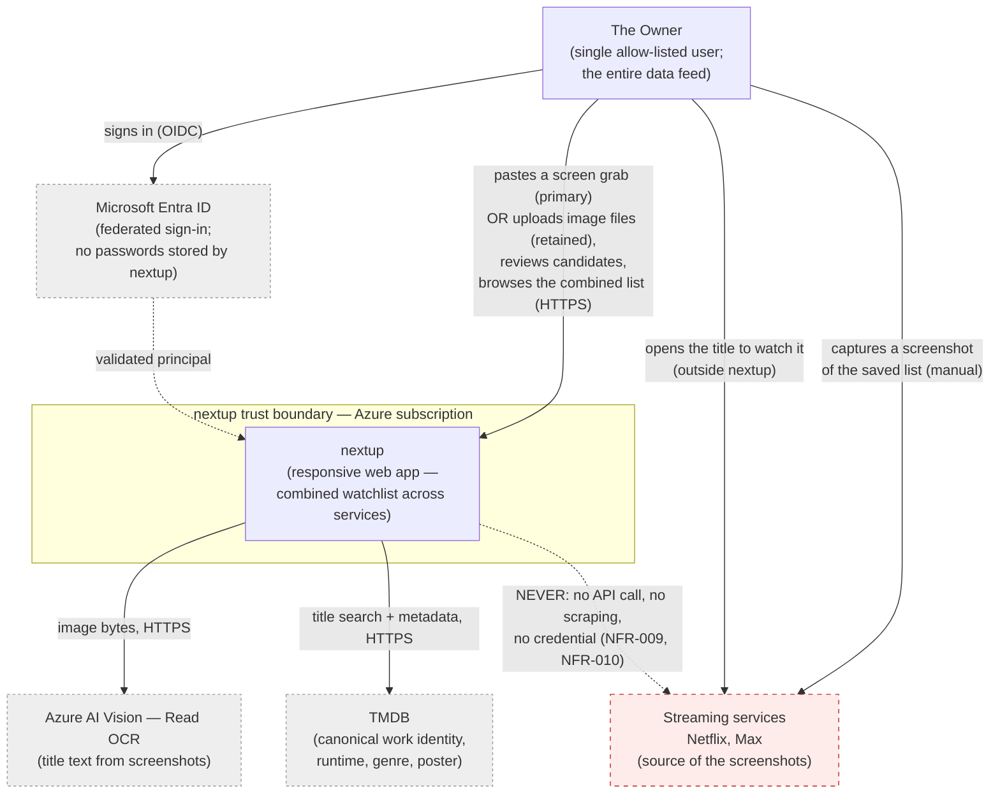

# System context — nextup

**Type:** C4 Level 1 — system context
**Shows:** nextup in its environment: the one human who uses it, the systems it depends on, and the systems it deliberately does not touch.
**Traces to:** REQ-001, REQ-008, REQ-009, REQ-029, NFR-009, NFR-010, NFR-013, NFR-015, NFR-017

> ⚠ **REVISION 7 (`A45`, ADR-0009).** Corrected in place: the owner's edge
> said *"uploads screenshots"*, which stated the wrong primary interaction.
> The owner's expected path is **paste a screen grab directly into the
> app**; **file upload is retained** and remains the only route for the
> laptop save-then-upload case and the iOS Photos case.

## Explanation

**There is one human in this diagram, and that is the point.** nextup
serves a single allow-listed owner (NFR-015, NFR-017) — there is no
signup surface, no second role, and no administrator. The owner is also
the *entire* data feed: nothing enters nextup except by the owner
**pasting a screen grab straight into the app (the primary interaction —
`A45`, R7) or uploading image files (retained, and the only path for the
laptop save-then-upload case and the iOS Photos case)**, which is why the
PRD names the owner as a first-class external dependency (§12.2).

**The link that does not exist is the most important element here.**
The dashed red edge to the streaming services records a hard
prohibition, not an unimplemented feature. Phase 3 research closed
`OQ-002` negative: no public API, no partner route, no automatable
export, and terms of service that prohibit automated access with an
account-termination remedy. `NFR-009` and `NFR-010` make this permanent
— nextup never stores a streaming credential and never issues a request
to a streaming service. The owner's two solid edges to the services are
both **manual human actions**: taking a screenshot, and later opening the
service to watch something. nextup sits alongside that relationship, not
inside it.

**Three external systems are depended upon, each for exactly one thing:**

- **Microsoft Entra ID** authenticates the owner (ADR-0002). nextup
  stores no password and implements no credential flow (NFR-016); it
  receives a validated principal and checks it against a configured
  allow-list.
- **Azure AI Vision (Read OCR)** turns uploaded screenshot bytes into
  text (ADR-0001). It is the only metered component in the system, and
  at projected volume it costs $0 on the free tier.
- **TMDB** supplies canonical work identity plus the runtime, genre,
  year, type and poster the combined list is filtered and sorted by
  (REQ-029). Its use carries two binding obligations that appear
  throughout the architecture: mandatory logo-plus-disclaimer
  attribution (NFR-013) and a 6-month cache ceiling (NFR-014), the
  latter being what forces the lazy refresh-on-access design.

## Notes and caveats

- Deliberately omits every internal component — see
  `container-diagram.md`.
- Deep-linking out to a service (the end of the value loop, `J-1`) is
  shown as the owner opening the service, because that is literally what
  happens: nextup does not launch or control anything.
- The seven non-spine services (Disney+, Prime Video, Peacock, Apple
  TV+, Paramount+, Starz, Fandango at Home) are out of v1 scope. Their
  addition is configuration, not integration — the mechanism is
  service-agnostic.
- No analytics, telemetry or monitoring vendor appears, because none
  exists (NFR-005).
