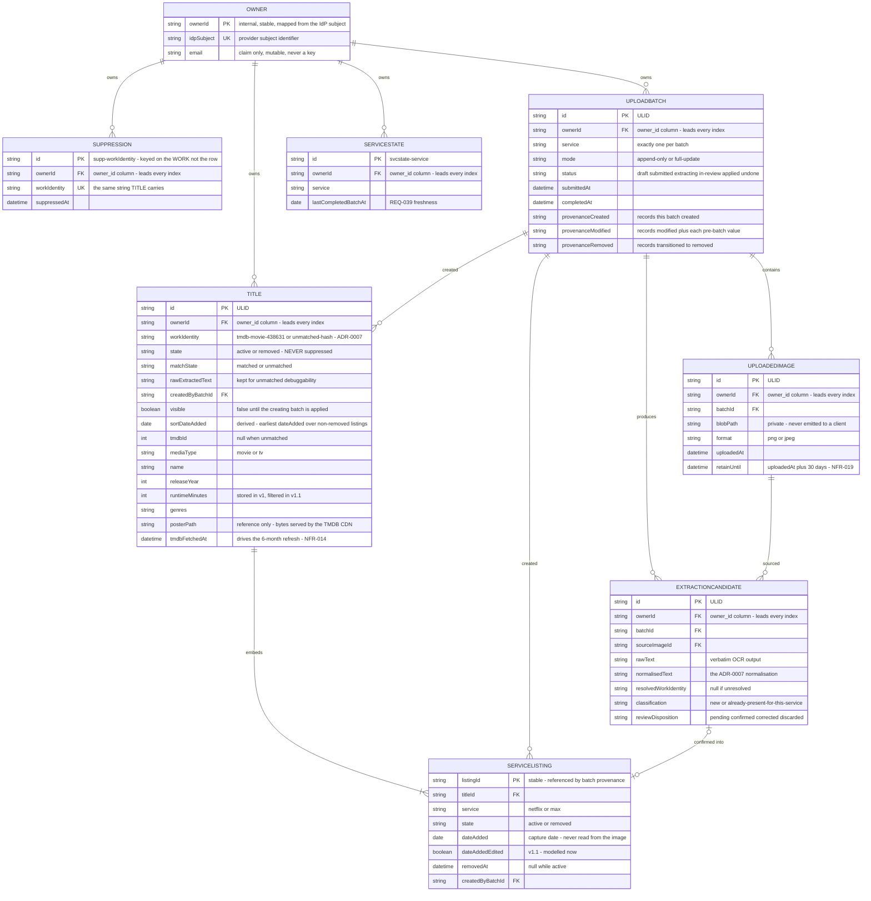

# Data model — entity relationships

**Type:** Entity relationship diagram
**Shows:** the persisted entities, their cardinalities, and the attributes that carry the load-bearing semantics.
**Traces to:** REQ-024, REQ-025, REQ-028, REQ-030, REQ-036, REQ-062, REQ-065, REQ-068, REQ-070, REQ-071, REQ-074, REQ-076, NFR-001, NFR-008, NFR-014, NFR-019

> ⚠ **REVISION 4 — Azure SQL (A40, Variant A).** The **logical** model
> below is **again unchanged** — entities, cardinalities and semantics are
> identical. Only the *physical* store changed: ADR-0005 Rev 3 replaced
> PostgreSQL with **Azure SQL Database Basic**. Each entity is still a
> **table**; types become T-SQL (`NVARCHAR`, `DATETIME2`, `BIT`), the three
> invariants become **filtered unique indexes**, and `pg_trgm` search
> becomes `LIKE`. The authoritative physical schema is now
> **`specs/data-model.md` §16** (§15, PostgreSQL, retained). Notes flagged
> **(R4)** below are the only prose that changed. R3 banner retained.

> ⚠ **REVISION 3 — 2026-08-10T21:45.** This diagram is the **logical**
> model and it is **unchanged by A41** — the entities, cardinalities and
> semantics below are exactly as before. What changed is the *physical*
> model underneath it: ADR-0005 Rev 2 replaced Cosmos DB with
> **PostgreSQL**, so each entity here is now a **table**, `SERVICELISTING`
> is a real child table rather than an embedded array, the `visible` flag
> and its protocol are **gone** (one transaction replaces them), and the
> three `provenance*` arrays become rows in a `batch_change` table.
> The authoritative physical schema is **`specs/data-model.md` §15**.
> Notes flagged **(R3)** below are the only prose that changed.

## Explanation

**`workIdentity` is the spine of the model.** It appears on `TITLE` and
is the entire primary key of `SUPPRESSION`, and four separate behaviours
depend on it: one row per canonical work (REQ-024), cross-service dedup,
reappearance semantics (REQ-065), and — most dangerously —
suppression (REQ-071). Its format and the fallback for unmatched titles
are `ADR-0007`, which remains **Proposed** because `OQ-015` is not the
architect's to close.

**`SUPPRESSION` is a separate entity, and that is a requirement, not a
modelling preference.** `requirements.md` §1.7 forbids collapsing the
three title states into one flag, and REQ-071 requires suppression to be
keyed on canonical work identity rather than on a row. The reason is
mechanical: under REQ-065, a removed work that reappears in a later
capture becomes a **brand-new `TITLE` row**. A suppression stored as a
field on `TITLE` would therefore be bypassed on the very next capture,
the owner's dismissal would silently stop working, and nothing anywhere
would report an error. Because `SUPPRESSION.id` is derived from
`workIdentity`, the suppression check during extraction is a point-read
on a known key, and uniqueness per work is guaranteed by the store.

**Three states live in three different places** — deliberately, so that
collapsing them is awkward rather than merely discouraged:

| State | Where | How determined |
|---|---|---|
| listing `active`/`removed` | `SERVICELISTING.state` | set by reconciliation or restore |
| title `active`/`removed` | `TITLE.state` | derived: `removed` iff every listing is `removed` (REQ-028) |
| `suppressed` | **a `SUPPRESSION` row** | existence of a row for that `workIdentity` |

**Nothing is ever deleted except image bytes.** `TITLE` and
`SERVICELISTING` carry a state, never a tombstone, and REQ-028 forbids
any purge, expiry or retention cutoff over them. `UPLOADEDIMAGE` is the
sole exception and even then only its *bytes* go: the record survives,
with `retainUntil` written once at upload and availability derived from
it, so `NFR-019` needs no database writer (ADR-0006).

**`UPLOADBATCH` carries reversal provenance in three explicit arrays.**
`REQ-068` requires enough to reverse everything a batch did: what it
created, what it modified *together with each pre-batch value*, and what
it transitioned to `removed`. This survives in full even though v1 undo
is restricted to creates-only (REQ-067), because `REQ-075`'s refusal must
enumerate exactly what a mixed batch touched — and it reads that
enumeration straight out of these three arrays. The creates-only test is
then a pure data question: both the modified and removed arrays are
empty.

**~~`visible` plus `UPLOADBATCH.status` is how REQ-005/REQ-006 are
guaranteed.~~ (R3 — SUPERSEDED.)** In the Cosmos model, documents written
during extraction carried `visible: false` and one atomic single-document
write flipped the batch to `applied`, because a write set larger than 100
operations could not be made atomic. **On the relational store (PostgreSQL
in R3, Azure SQL in R4) the whole review
pass is a single transaction**, so the flag, the flip and the
`visible = true OR createdByBatchId IN (...)` predicate every reader had
to remember are all **deleted** (ADR-0005 R2.3; unchanged on Azure SQL,
R4). `REQ-005`/`REQ-006` are
now guaranteed by the database's atomicity directly: a partially-written
batch never exists. `UPLOADBATCH.status` survives as the owner-facing
lifecycle state, not as a visibility mechanism.

**~~`SERVICELISTING` is embedded inside its `TITLE` document~~ (R3 —
SUPERSEDED; unchanged in R4.)** It is now a **real child table** with a
foreign key to `title` and an `ON DELETE` rule, which is closer to what
the requirements
described in the first place. The relationship is still drawn as
identifying (`||--|{`) because a listing has no meaning without its
title. Listings keep stable `listingId`s so batch provenance can
reference them precisely. Modelling it separately here was always
correct: embedding was a storage decision, not a domain one — and R3
removed the storage decision that forced it.

**`dateAdded` means "the date nextup first saw this title"** (REQ-030),
never a date read out of the screenshot, and REQ-061 requires it to be
labelled that way wherever it is shown. `TITLE.sortDateAdded` is the
derived **earliest** `dateAdded` across non-removed listings (REQ-036) —
which is why adding a title on a second service does not move the row.

## Notes and caveats

- **Entity names here must match `specs/data-model.md` exactly.** A
  mismatch is a blocking review finding.
- Mermaid `erDiagram` attribute syntax does not permit `:`, `<`, `>` or
  parentheses in comments, so composite values are written with hyphens
  (`tmdb-movie-438631` means `tmdb:movie:438631`; `supp-workIdentity`
  means `supp:<workIdentity>`).
- **(R4)** `genres` is a JSON array in `NVARCHAR(MAX)` with
  `CHECK(ISJSON()=1)` *(R3 was a PostgreSQL `text[]`)*. The three
  `provenance*` fields are **no longer arrays at all** — they became rows
  in a `batch_change` table with a `kind` discriminator (`title_created`,
  `listing_added`, `listing_removed`), which is what makes creates-only
  undo a plain `DELETE … WHERE batch_id = @1 AND kind = 'title_created'`
  instead of array surgery. `erDiagram` has no array type, and this note
  is the reconciliation.
- **(R4)** The physical representation is **Azure SQL Database Basic** —
  nine tables, real foreign keys, a **filtered unique index** for the
  one-non-removed-title invariant (`WHERE state = 'active'`),
  `NVARCHAR(MAX)` + `CHECK(ISJSON()=1)` only where the data is genuinely
  document-shaped (`match_candidates`, `bounding_boxes`,
  `extraction_stats`, and the `genres` JSON array). It is
  specified in **`specs/data-model.md` §16** and decided in ADR-0005
  Rev 3. *(R3 was PostgreSQL, §15, retained; R1 was Cosmos.)* This diagram
  remains the logical model.
- **(R3)** `OWNER` is not a stored row. It is the authenticated
  principal, materialised as an `owner_id` **column on every table**,
  leading every index and passed as the first argument of every
  repository function (NFR-008) — ~~used as the partition key~~. It is
  drawn to make the NFR-001 multi-owner path explicit. Because the store
  no longer makes a cross-owner read structurally expensive, the
  owner-scoping test in `specs/testing.md` is now load-bearing.
- v1.1 fields (`dateAddedEdited`) are modelled now and unused, so the
  deferred REQ-059 is additive rather than a migration.
