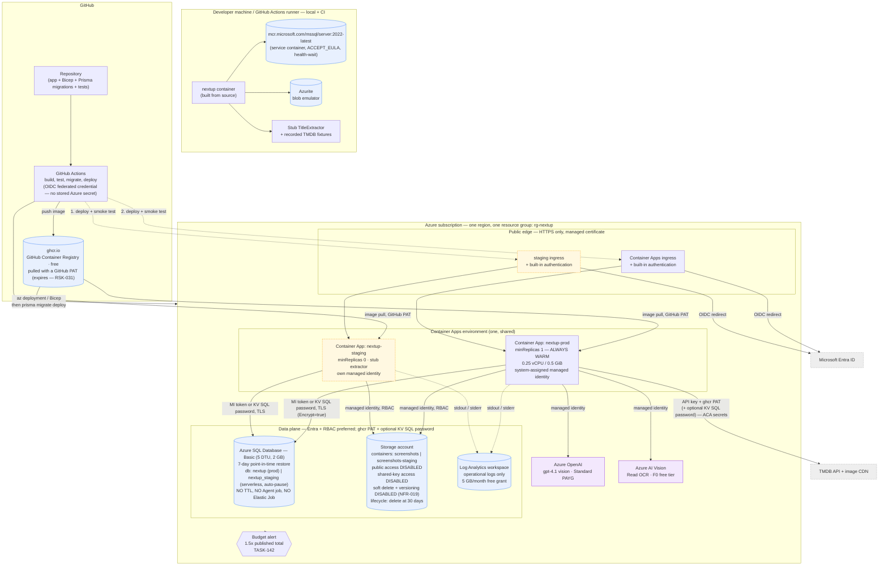

# Deployment — nextup

**Type:** Deployment diagram
**Shows:** environments, Azure resources, network and trust boundaries, and the promotion path.
**Traces to:** NFR-003, NFR-008, NFR-011, NFR-012, NFR-015, NFR-019, NFR-020, REQ-041

> ⚠ **REVISION 4 — owner selected Variant A (A40).** Redrawn again. Changed
> from R3: **the datastore is Azure SQL Database Basic, not PostgreSQL**;
> **the registry is ghcr.io (GitHub PAT pull), not ACR — the registry
> secret RETURNS**; **compute is 0.25 vCPU / 0.5 GiB, not 0.5/1.0**; **PITR
> is 7-day, not 35-day**; **staging is a separate serverless auto-paused
> Azure SQL database**. Always-warm and staging retained. Reasoning:
> ADR-0003 Rev 3, ADR-0005 Rev 3, `architecture.md` §Cost summary. R3
> banner retained below.

> ⚠ **REVISION 3 — 2026-08-10T21:45.** Redrawn after constraint change
> **A41/CC-002** relaxed `NFR-012` system-wide. Four things changed in
> this picture: **the datastore is PostgreSQL, not Cosmos DB**; **compute
> is always warm (`minReplicas = 1`)**; **the registry is Azure Container
> Registry, pulled by managed identity, so the ghcr.io secret is gone**;
> and **a staging environment now exists**. Reasoning: ADR-0003 Rev 2,
> ADR-0005 Rev 2, `architecture.md` §Cost summary.

## Explanation

**There are three environments, two of them in Azure.** Development and
CI run entirely against containers on the runner —
**`mcr.microsoft.com/mssql/server:2022-latest`** and Azurite — with a stub
`TitleExtractor` and recorded TMDB fixtures, so the full suite runs
offline, deterministically and for free. **R4: the CI store fixture is a
SQL Server 2022 service container** (R3 used `postgres:16-alpine`; R1 used
the Cosmos emulator). It is heavier than the Postgres image (~2 GB RAM,
`ACCEPT_EULA`, a health-wait), so `testing.md` §3.3a pins the exact
GitHub Actions service config — because `NFR-003` makes CI load-bearing
and a flaky gate is a broken gate.

**A staging environment now exists, and it is deliberately tiny.** It is
a second Container App in the *same* Container Apps environment
(`minReplicas = 0` — nobody judges staging's cold start), a **separate
serverless auto-paused Azure SQL database** (`nextup_staging`), and a
second blob container on the same storage account. **R4: because Azure SQL
bills per database (unlike PostgreSQL's shared server), staging is ~$0.50/mo
storage-floor, not $0.** It exists because
`NFR-002` hands implementation to an autonomous agent and `RSK-016` is
that the agent gets something subtly wrong: without staging, its only
place to discover an infrastructure-shaped defect is the owner's real,
never-deleted, un-recreatable data (`REQ-028`). Emulators cannot rehearse
managed-identity RBAC, Easy Auth redirect URIs, registry pull permission or a
Bicep deployment against a real subscription — exactly the list of things
that break on a first deploy. **`RSK-025` stays Low.**

Staging runs the **stub extractor** by default and holds **synthetic
fixtures only**. The owner's real screenshots never leave production, and
no production data is ever copied down. **R4: staging and prod are now
separate Azure SQL databases** (a small improvement over R3's shared PG
server), so a database-level failure no longer affects both; they still
share a storage account, which is the remaining accepted give-up.

**The system now holds 2–3 secrets (R4 — was one).** The TMDB API key and
**the ghcr.io pull PAT** are Container Apps secrets. **The registry PAT
RETURNS**: the image moved from Azure Container Registry back to **ghcr.io**
(ADR-0003 R3.1), which has no managed-identity pull, so a GitHub PAT is
required — and it **expires quietly**, the exact time-bomb R3 had removed,
accepted here for the ~$5/mo saving (`RSK-031`-adjacent). The database
credential is **still secretless if managed-identity auth works through
Prisma** (proven at `M0`, `TASK-141`); if not, the fallback is a
Key-Vault-stored SQL login password — which, unlike the PAT, does not
silently expire. Azure SQL supports Entra/MI auth, so the DB credential can
stay out of the system even though the registry one cannot.

**The value loop no longer waits for anything to start.** `minReplicas = 1`
means the container is always warm, and **Azure SQL Basic has no auto-pause**
(only the serverless *staging* DB pauses). `RSK-023` — the 2–8 second cold
start that landed on the one screen `SUC-001` is measured by — is **closed
by removing its cause**, at ~$5–8/month (R4). At one user, almost every
session was a cold session, so scale-to-zero was cheapest exactly where it
hurt most.

**Four configuration details are load-bearing requirements, not
hardening niceties.**
`public access DISABLED` and `shared-key access DISABLED` are what make
`NFR-020` true. **`soft delete + versioning DISABLED` is what keeps
`NFR-019` true** — and this one is counter-intuitive enough to be
dangerous: enabling blob soft delete looks like good practice, costs
pennies, and would **silently retain the owner's screenshots past 30
days** while every test still passes (ADR-0006). And **`NO TTL, NO Agent
job, NO Elastic Job`** on the database is the deployment-level expression of
`REQ-028`: nothing in the list data may ever expire, so the mechanism
that could expire it is simply not present.

**The only scheduled thing in the whole deployment is still the blob
lifecycle rule.** It runs inside the storage service, deletes image bytes
at 30 days (`NFR-019`), and writes nothing to the database. There is no
Container Apps Job, no cron container, no Logic App, no Function timer,
**no Azure SQL Agent job and no Elastic Job**. `REQ-041`'s guarantee — that
only the owner changes user-visible list state — is defended by the absence
of the machinery that would violate it.

**The promotion path gained a step and a gate.** Push to `main` → build
and test → image to **ghcr.io** → Bicep + `prisma migrate deploy` to
**staging** → staging smoke test → Bicep + migrate to `prod` → prod smoke
test → traffic shifted. Rollback is a revision switch. A migration that
would drop a column fails CI (`T-MIG-001`, restated for T-SQL destructive
forms), because `REQ-028` forbids losing data and a schema is the one place
an autonomous implementer could lose it quietly.

## Notes and caveats

- **Region:** a single region supporting **Azure SQL Database Basic**,
  the Azure AI Vision F0 tier and a `gpt-4.1` deployment with
  quota — East US or equivalent. **To be confirmed as a first-sprint
  task** (`TASK-010`) before the Bicep is finalised.
- **No VNet, no private endpoints, no WAF, no DDoS protection — still,
  and now by choice rather than by budget.** These became affordable at
  A41 and were re-examined and rejected: the data plane is reachable only
  by managed identity (or, for the DB fallback, a KV-referenced password),
  ingress is authenticated at the platform edge, and
  there is one user. The **Azure SQL public endpoint** is restricted to
  Azure services and requires TLS (`Encrypt=true`). Buying network isolation
  here would add several resources an autonomous implementer must get right in
  exchange for no threat this system faces (ADR-0003 R2.5).
- **No HA replica, no zone redundancy, no read replica, no failover group,
  no second region, no autoscaling rule.** One user. Zone-redundant HA
  roughly doubles the database bill to protect a single-user watchlist
  against an event that would be a few hours of inconvenience.
- No CDN in front of the app. Poster images already come from TMDB's own
  CDN directly to the browser, and `minReplicas = 1` removed the
  first-paint problem a CDN would have solved.
- **Backup: 7-day point-in-time restore** on Azure SQL Basic (the Basic
  maximum) — **down from PostgreSQL's 35-day window (R4, the accepted cost
  of Variant A).** Because `REQ-028` forbids any hard delete or TTL, the
  store is effectively irreplaceable, so a corruption not noticed within 7
  days is unrecoverable from PITR. **`OQ-025` RE-WIDENS**, and `TASK-131`
  (a weekly logical `BACPAC` export to the blob account) is recommended
  early as the real mitigation; LTR is the named escalation. See
  `data-model.md` §16.11.
- **Budget alert (`TASK-142`)** at 1.5× the published monthly total. It
  costs nothing and turns an unverified cost estimate (`RSK-029`) into a
  monitored one.
- ⚠ **All prices in this diagram and its notes are Azure list figures
  recalled from model knowledge and are UNVERIFIED** — web retrieval was
  unavailable to the architect. `TASK-010` re-verifies them.
