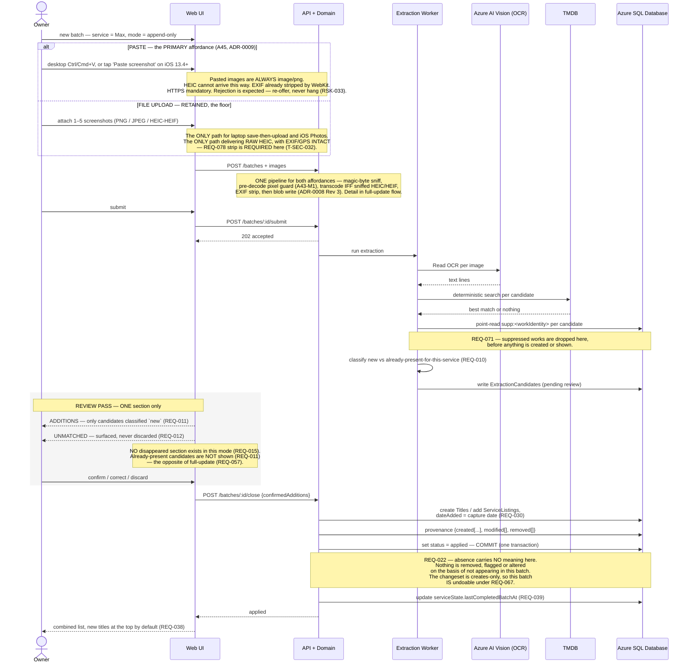

# Sequence — append-only upload (the ongoing top-up)

**Type:** Sequence diagram
**Shows:** the additive path — the routine flow, and the one that must stay cheap.
**Traces to:** REQ-001, REQ-002, REQ-003, REQ-005, REQ-010, REQ-011, REQ-012, REQ-013, REQ-022, REQ-030, REQ-068, REQ-071
> ⚠ **REVISION 7 (A45, ADR-0009):** ingest now has **TWO affordances converging on ONE pipeline** — **clipboard paste (the PRIMARY interaction)** and **file upload (RETAINED, the floor)**. The transcode is **conditional on the sniffed type** (ADR-0008 Rev 3). Detailed steps are drawn in `sequence-full-update-batch.md`; this additive flow is otherwise unchanged.
> ⚠ **REVISION 5 (A42, ASM-058):** ingest accepts **PNG, JPEG *and* HEIC/HEIF**; HEIC/HEIF is transcoded to **lossless PNG on ingest**, EXIF/GPS stripped, before the blob is written (ADR-0008). The detailed attach/transcode steps are drawn in `sequence-full-update-batch.md`; this additive flow is otherwise unchanged.
> ⚠ **REVISION 4 (A40, Variant A):** the datastore participant `DB` is now **Azure SQL Database Basic** (was PostgreSQL in R3, Cosmos in R1); registry is **ghcr.io**; compute is **0.25 vCPU / 0.5 GiB**. The flow itself is unchanged — only the store, registry and compute labels move. See ADR-0005 Rev 3 / ADR-0003 Rev 3, `specs/data-model.md` §16.

## Explanation

**The difference from full-update is not a shortcut — it is a different
meaning of absence.** In append-only mode, a title that does not appear
in the batch means nothing at all (REQ-022). There is no reconciliation,
no disappeared section, and no possibility of data loss. That is why the
review pass is allowed to be shorter here: `REQ-011` hides
already-present candidates because there is nothing for the owner to
verify, whereas `REQ-057` *requires* showing them in full-update mode
because there absence is dangerous. The two rules look contradictory and
are not — they are the same safety principle applied to two different
semantics, resolved at A24 with both `ASM-019` and `ASM-020` kept true,
each scoped to its mode.

**This is the flow the product lives or dies on.** The one-time bulk
import happens once; this happens every few weeks, forever. `OQ-011`
identifies review interaction cost as the most likely cause of
abandonment, and this path is where that cost is paid routinely. Showing
only genuinely new items is the primary lever the requirement set pulls
to keep it cheap.

**Everything else is identical to full-update**, deliberately: the same
batch boundary, the same suppression check before creation, the same
"unmatched is surfaced, never discarded", the same **single-transaction
close** *(R3 — was a single atomic `applied` write plus a visibility
flag; see `sequence-full-update-batch.md`)*, the same provenance. One
pipeline, one set of tests, one mode flag.

**An append-only batch is always creates-only**, so it is always
undoable under `REQ-067`. This is not a coincidence — it is the property
that made the A36 decision to restrict v1 undo to creates-only
defensible. The one-time bulk first import runs against an empty list and
therefore also only creates, so the two situations where undo matters
most are exactly the two it covers.

## Notes and caveats

- **Ingest has two affordances and one pipeline (R7, `A45`, ADR-0009).**
  Paste is the owner's expected primary interaction — a document-level
  `paste` listener on desktop, a visible **"Paste screenshot" button**
  calling `navigator.clipboard.read()` on iOS 13.4+. **File upload is
  retained as the floor** and is the only path for the laptop
  save-then-upload case and the iOS Photos case. ⚠ **WebKit strips EXIF on
  clipboard read but NOT on file upload**, so `REQ-078`'s explicit strip
  stays on the upload path. The routine top-up flow is otherwise identical
  on both affordances.
- `dateAdded` is the capture date — "the date nextup first saw this
  title" (REQ-030) — never a date read from the screenshot, and it must
  be labelled accordingly wherever it appears (REQ-061).
- Editing `dateAdded` (REQ-059) is deferred to v1.1. **Reinstating it
  into v1 reopens decision D3 and OQ-023**, because the creates-only undo
  restriction rests on `dateAdded` being the only modifiable attribute on
  the reconciliation path and being out of scope.
- Failure paths are omitted; they are identical to the full-update flow
  and none may change list state.
- Adding an existing work on a second service does **not** move the row
  in the default ordering: the sort value is the *earliest* `dateAdded`
  across non-removed listings (REQ-036). This surprises people and is
  correct.
