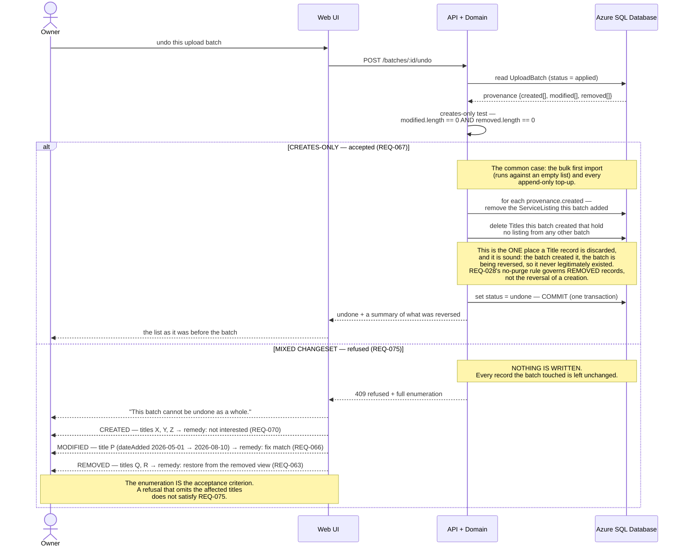

# Sequence — batch undo (creates-only), and the refusal of a mixed batch

**Type:** Sequence diagram
**Shows:** both outcomes of `POST /batches/:id/undo` — the accepted creates-only case and the refusal, which is a feature rather than an error path.
**Traces to:** REQ-067, REQ-068, REQ-069 (v1.1), REQ-075, REQ-041, REQ-063, REQ-066, REQ-070
> ⚠ **REVISION 4 (A40, Variant A):** the datastore participant `DB` is now **Azure SQL Database Basic** (was PostgreSQL in R3, Cosmos in R1); registry is **ghcr.io**; compute is **0.25 vCPU / 0.5 GiB**. The flow itself is unchanged — only the store, registry and compute labels move. See ADR-0005 Rev 3 / ADR-0003 Rev 3, `specs/data-model.md` §16.

## Explanation

**The refusal branch is the reason this diagram exists.** `A36` /
decision D3 restricted v1 undo to batches whose changeset consists
exclusively of records they created, and deferred the mixed-changeset
case (REQ-069) to v1.1. A bare "this batch cannot be undone" would leave
the owner **strictly worse off than having no undo at all**: they would
know something had gone wrong and have no idea what to repair.
`REQ-075` therefore requires the refusal to enumerate exactly what the
batch created, what it modified with the pre-batch value of each
modified attribute, and what it transitioned to `removed` — each with
the per-title remedy that *is* available. The requirement is explicit
that the enumeration is the acceptance criterion, not a nicety.

**The creates-only test is a pure data question, not an inference over
history.** `REQ-068` requires the three provenance arrays to be written
at batch close whether or not undo will ever be invoked, so the test is
`modified.length === 0 && removed.length === 0` — cheap, exact and
testable. This is also why REQ-068 survived the A36 restriction in full
while REQ-069 was deferred: the refusal needs the same provenance the
full undo would have needed.

**Which batches qualify is not accidental.** An append-only batch only
ever creates. The one-time bulk first import runs against an empty list
and therefore only creates. Those are precisely the two situations where
undo matters most — a systematic extraction failure during a 300-title
import, where repairing rows individually would be intolerable. The
restriction was chosen to cover the cases that matter and refuse
loudly elsewhere.

**Undo does discard records, and that is not a violation of REQ-028.**
The distinction is between reversing a creation and purging history.
`REQ-028` forbids ever deleting a `Title` or `ServiceListing`, or running
any purge or expiry over them — it is about **removed** records, which
are history the owner may want back. A creates-only undo says the batch
never legitimately happened, so the records it created are unwound. If
this reading is ever doubted, the safe alternative is to mark them
`removed` rather than discard them; `specs/data-model.md` must state
which, explicitly, because an autonomous implementer will otherwise pick
one silently. **The architect's recommendation is to discard**, because
leaving several hundred spurious rows in the removed view after undoing a
bad import would poison the very view `REQ-062` exists to make useful.

**Undo is an owner-initiated action inside REQ-041's closed
enumeration** (item 6 in PRD §7.4). It changes user-visible list state
and is permitted only because it is listed there.

**`OQ-023` — how undo interacts with later owner edits — does not arise
in v1**, because a creates-only batch has no modified attributes to
adjudicate. It returns to blocking if `REQ-059` (editable `dateAdded`) is
reinstated into v1.

## Notes and caveats

- No expiry is imposed on undo. The record states none and none is
  invented (REQ-067).
- The mixed-changeset undo (REQ-069) is retained in full in the
  requirement set so that the v1.1 requirement is not rewritten from
  scratch.
- `REQ-074` re-extraction against retained images is the **partial**
  substitute for the deferred mixed undo — partial, and stated as
  partial, because it expires with the 30-day image window (NFR-019).
  Beyond that window a mixed batch has no recovery path except the
  per-title remedies enumerated in the refusal.
- The remedies offered in the refusal are exactly the three reversibility
  mechanisms settled at A30: restore (REQ-063), fix match (REQ-066), and
  batch undo itself. A general change history was explicitly declined by
  the user and appears nowhere.
