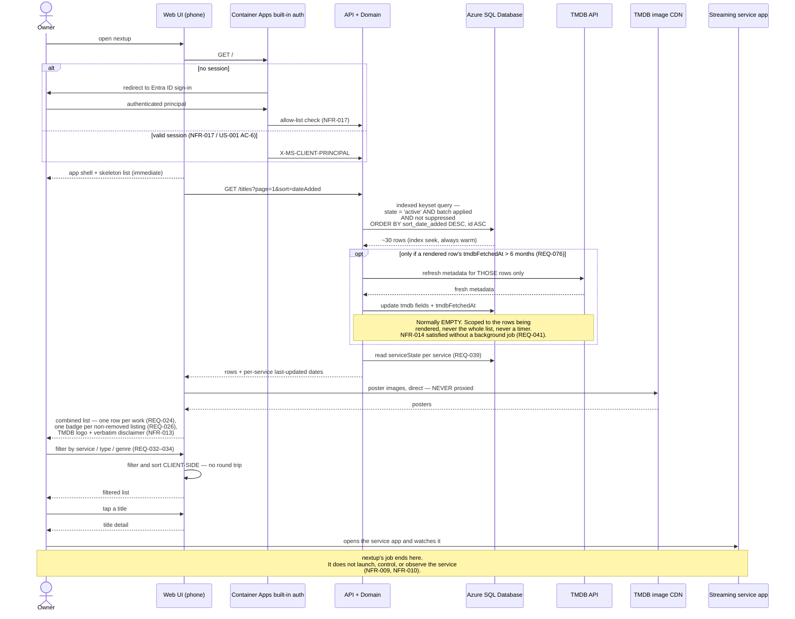

# Sequence — the value loop: open the list → filter → deep-link out

**Type:** Sequence diagram
**Shows:** `J-1`, the reason the product exists and the path that must feel fast.
**Traces to:** REQ-024, REQ-026, REQ-031, REQ-032, REQ-033, REQ-034, REQ-036, REQ-038, REQ-039, REQ-076, NFR-005, NFR-006, NFR-007, NFR-013, NFR-014
> ⚠ **REVISION 4 (A40, Variant A):** the datastore participant `DB` is now **Azure SQL Database Basic** (was PostgreSQL in R3, Cosmos in R1); registry is **ghcr.io**; compute is **0.25 vCPU / 0.5 GiB**. The flow itself is unchanged — only the store, registry and compute labels move. See ADR-0005 Rev 3 / ADR-0003 Rev 3, `specs/data-model.md` §16.

## Explanation

**This is `SUC-001` in one picture**: the owner stops opening every
streaming app to browse and checks nextup instead. If this path is slower
or more annoying than opening Netflix, the product fails regardless of
how good the rest of it is. Three design decisions exist purely to
protect it.

**One: no third-party call on the critical path in the common case.**
The list is served from **Azure SQL Database Basic**, which is always on —
no auto-pause on the Basic tier (only the serverless *staging* DB pauses)
— and, **as of Revision 3, the container in front of it
no longer cold-starts either** (`minReplicas = 1`, ADR-0003 R2.1). *(R4:
the store moved PostgreSQL → Azure SQL Basic per ADR-0005 Rev 3; the
always-warm property this flow depends on is unchanged, and the query is
an index seek rather than a Cosmos single-partition read.)* The only
outbound call
that *could* appear here is the `REQ-076` lazy TMDB refresh, and it is
bounded three ways: it fires only when a title's stored metadata has
passed the 6-month `NFR-014` ceiling, it is scoped to **the rows actually
being rendered on the current page** rather than the whole list, and it
is empty for the first six months of any title's life. The alternatives
were both rejected in the requirement set: refresh-on-upload leaves
untouched titles permanently stale, and fetching everything live puts
TMDB on the critical path of the one loop that must always be fast.

**Two: posters are never proxied.** The browser loads them straight from
TMDB's image CDN using the stored `posterPath` reference. They consume
none of our compute, none of our bandwidth, and none of the request's
latency budget — and the API response stays small enough to be fast even
on a phone connection.

**Three: filtering and sorting are client-side.** A few hundred rows fit
comfortably in memory, so `REQ-032`–`REQ-034` and `REQ-036` are instant
with no round trip. The owner is standing in front of a television
deciding what to watch; a network round trip per filter tap is exactly
the friction the product exists to remove.

**What the list shows is as constrained as how fast it is.** One row per
canonical work no matter how many services hold it (REQ-024), one badge
per **non-removed** listing (REQ-026), removed and suppressed works
excluded entirely (REQ-024, REQ-028), default order by date added most
recent first (REQ-038) where a row's date is the **earliest** across its
non-removed listings (REQ-036). Per-service last-updated dates
(REQ-039) are on this screen
because the list is only as fresh as the last upload, and a silently
stale list that still looks authoritative is a direct attack on
`SUC-001`. *(A46: the list-staleness nudge past 30 days, formerly
REQ-040, was dropped entirely from v1 — the date display is the only
freshness signal now.)*

**TMDB attribution is on this screen and is not optional.** `NFR-013`
requires the TMDB logo plus the verbatim disclaimer on any view
rendering TMDB data. Its failure is invisible from inside the app, which
is why the PRD mandates an automated test for it (US-011 AC-5).

**Nothing is measured.** There is no analytics call in this diagram
because none exists (`NFR-005`). Success is observed by the owner's own
self-assessment.

## Notes and caveats

- ~~**Cold start is the honest weak point.**~~ **RESOLVED in Revision 3.**
  Rev 1 ran at `minReplicas = 0`, so the first request of a session paid
  2–8 seconds of container start-up before any of the above happened, and
  the escalation to `minReplicas = 1` was rejected on cost. When
  `NFR-012` was relaxed at A41 that rejection lost its premise and was
  reversed (ADR-0003 R2.1): **the container is now always warm**, and
  `RSK-023` is closed. The app shell and skeleton state (PRD §9.2) remain
  as the defence against a slow network rather than a slow start.
  `OQ-014` still leaves performance targets deliberately unspecified, so
  no numeric target is invented here.
- Pagination is shown as page 1; the list is paginated by an **opaque
  keyset cursor** over an indexed sort column *(R3 — was a Cosmos
  continuation token)*, which is what makes `NFR-018`'s
  scale-invariance claim true for the removed view.
- Deep-linking is the owner opening the service themselves. Launching
  titles inside a streaming app is out of scope in every release
  considered so far.
- The removed view, suppressed view and freshness detail are separate
  surfaces reached from this one and are not drawn.
- Sorting and filtering by runtime (REQ-035, REQ-037) are deferred to
  v1.1 — TMDB runtime is ambiguous for TV (episode / season / series) and
  the record contains no decision. Runtime is still stored (REQ-029), so
  v1.1 is purely additive.
