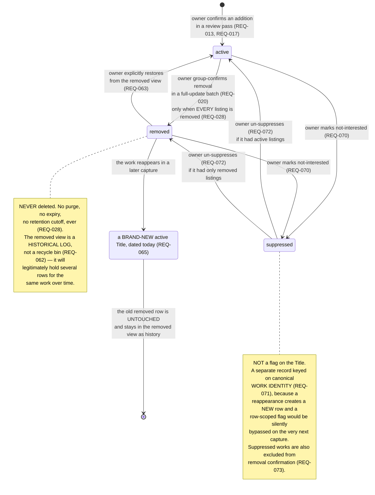

# State — canonical work as seen by the owner

**Type:** State machine
**Shows:** the three states of a work, every transition, and — critically — the transition that creates a new record rather than reactivating an old one.
**Traces to:** REQ-024, REQ-027, REQ-028, REQ-062, REQ-063, REQ-065, REQ-070, REQ-071, REQ-072, REQ-073, REQ-041

## Explanation

**`removed → new row` is the transition that reverses an assumption, and
it is the one an implementer is most likely to get wrong.** The
requirements clarifier inferred (ASM-047) that a reappearing removed
title would transition *back* to active, carrying its edits and history,
and wrote `REQ-065` on that inference. `A33` falsified it. A work that
reappears in a later capture is a **brand-new title dated today**; the
old removed row is not restored, not re-dated, and not modified, and any
owner edits held on it — a corrected match, an edited date — do **not**
carry over. It stays in the removed view as a separate historical record.

Two consequences follow, and both must reach the UI:

1. **The removed view will hold several rows for the same work.** That
   is correct behaviour, not duplication. `REQ-062` states it as a
   requirement precisely because an owner — or an implementer writing a
   de-duplication test — would otherwise read it as a bug and "fix" it by
   collapsing exactly the history the view exists to hold (PRD risk R-4,
   US-024 AC-6).
2. **Restore is an explicit owner action and only that** (REQ-063). No
   extraction, reconciliation or other automatic process may perform it.
   Without that clause an implementer could satisfy REQ-065 and still
   wire reconciliation into the restore path "for convenience".

**Suppression is drawn as a state but is stored somewhere else
entirely**, and that split is the point. `REQ-071` keys suppression on
canonical work identity, in a separate record, precisely *because* of the
`removed → new row` transition above: a flag on the `Title` row would be
bypassed on the very next capture, the owner's dismissal would silently
stop working, and nothing anywhere would report an error. The PRD
mandates the acceptance test that catches this — suppress, remove,
re-upload, and assert the work does not come back (US-028 AC-3, risk
R-5).

**Un-suppression is asymmetric, and the asymmetry must not be smoothed
over.** Un-suppressing does not restore a row — `REQ-063` does that. It
only makes the work eligible to be created again by a future batch, and
returns it to whichever view its listing states imply: the combined list
if it had active listings, the removed view if it had only removed ones
(PRD §7.1, US-029 AC-3/AC-4).

**`active → removed` at the title level is a roll-up, not a direct
action.** Removal operates on `ServiceListing`s (REQ-027): a full-update
batch for Netflix transitions only Netflix listings. The title becomes
`removed` when, and only when, *every* listing it holds is removed
(REQ-028) — so a title still held by Max does not disappear because
Netflix dropped it.

**Every transition on this diagram is owner-initiated**, and every one
appears in `REQ-041`'s closed enumeration (PRD §7.4). There is no
timer, no scheduler and no automatic path into or out of any state.
`REQ-041` has been widened five times during requirements work; widening
it again is an explicit amendment, not an implementation decision.

## Notes and caveats

- `newrow` is drawn as a terminal pseudo-state because the new `Title` is
  a *different record*, beginning its own lifecycle at `active`. It is
  shown here rather than in a separate diagram because the transition is
  only comprehensible next to the `removed` state it does not modify.
- The `[*] → active` entry excludes suppressed works: `REQ-071` tests
  suppression *before* any title or listing is created, so a suppressed
  work never enters the machine at all.
- Listing-level `active`/`removed` is a second, simpler state machine
  nested inside this one. See `data-model-erd.md` and
  `specs/data-model.md`.
- The creates-only batch undo (REQ-067) discards records the batch
  created rather than transitioning them, and is deliberately not drawn
  as a state transition — see `sequence-batch-undo.md` for why that is
  not a `REQ-028` violation.
