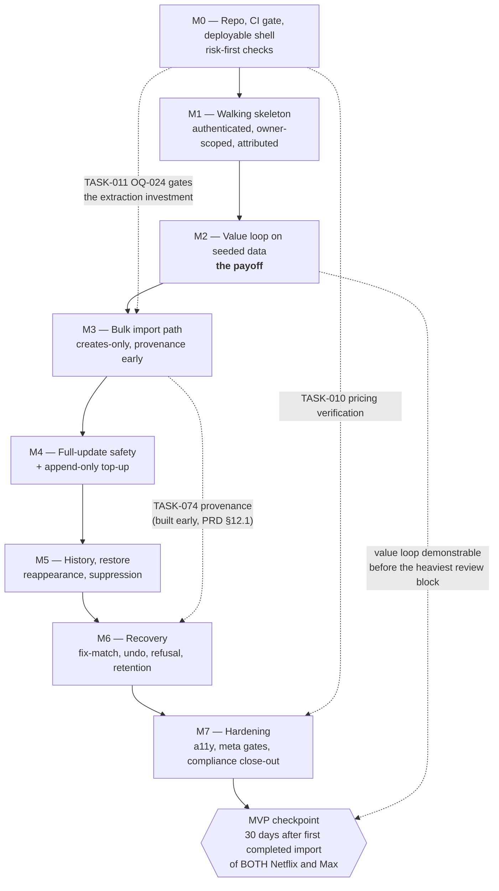

# Roadmap — nextup

## 0. A deliberate deviation from the template

The standard roadmap template asks for a Mermaid **`gantt`** chart. A `gantt`
requires `dateFormat` and dated bars. **A19 / ASM-027 forbid dates and
timelines for this project.** Rather than invent dates in order to satisfy a
diagram, this roadmap uses a Mermaid **dependency flowchart** instead. This
deviation is stated plainly here so no reader assumes it was an oversight.

There are no dates in this document. There is only **order**, **dependency**,
and **what each milestone makes demonstrable**.

The single checkpoint that *is* time-bound is event-anchored, not
calendar-anchored: see §4.

---

## 1. Milestone dependency graph

---

## 2. Milestones

> **Note on the "Contains" ranges below.** Each milestone's `Contains` line
> gives the **numeric `TASK-` range of the 133-task story baseline**
> (`TASK-001 … TASK-133`). Five later revisions **append** task-units to
> their milestones **without renumbering** — 5 extraction splits
> (`056b, 056c, 059b, 079b, 134`), 4 R3 units (`141–144`), 2 R4 units
> (`145, 146`), **7 R5 HEIC-ingest units (`147–153`)**, **4 R6 memory-
> containment units (`154–157`, `A43`/`OQ-028`)** and **8 R7 clipboard-paste
> units (`158–165`, `A45`)** — bringing the true
> total to **163 task-units** (the `backlog.md` frontmatter figure; see
> `backlog.md` §1.1 for the full reconciliation and counting convention). The
> ranges are therefore consistent with the backlog tables; the appended units
> live inside the milestone whose range brackets their dependency (e.g. `134`,
> `141–143`, `146` in M0; `144` in M0; `145` in **M2** (~~M1~~ — corrected at R6:
> `145` depends on `033`, which is M2); **the R5 units `147–152`
> (HEIC ingest → transcode) and `153` (LGPL licence sign-off) live in M3**,
> bracketed by the upload/extract range `048–080`, and `147–152` are
> **sequenced ahead of the extraction tasks** because extraction cannot run on
> HEIC bytes; **the R6 units `154` (per-image failure isolation), `155` (the
> memory error text), `156` (the up-size runbook in the repo) and `157` (the
> OOM alert + decode sentinel) also live in M3**, and `154` is likewise
> sequenced **ahead of** `058`; **the R7 units `158–165` (`A45` clipboard paste)
> also live in M3**, bracketed by the same `048–080` range because they are
> UI-layer work plus one small ingest-contract change on the *existing*
> pipeline — none of them is on the critical path, because file upload is a
> complete ingest path on its own). ~~…bringing the true total to 155 task-units.~~
> *(R6 figure — superseded at R7.)* ~~…bringing the true total to 151 task-units.~~
> *(R5 figure.)*

### M0 — Repo, CI gate, deployable shell, risk-first checks
**Goal:** give the autonomous implementer a working feedback signal, and answer
the two cheap questions that could invalidate everything downstream.

**Done when:**
- A clean clone runs `npm ci && npm run lint && npm run build`.
- All **12 CI jobs** are required and blocking; a deliberately broken test fails a PR.
- A commit to `main` builds an image, deploys via Bicep to a 0%-traffic revision, passes smoke, and shifts traffic.
- `T-INFRA-005` and `T-INV-013` prove free/consumption SKUs and **no TTL anywhere** — and (**R6**) that the **compute size and `NEXTUP_MAX_DECODE_PIXELS` are pinned as a PAIR** (`0.25 vCPU / 0.5 GiB` ⇄ `25000000`), so neither can be changed alone.
- **OQ-024 is closed** with one evidence screenshot per capture surface.
- ADR-0001 carries a dated pricing addendum verified against live Azure pages.

**Contains:** TASK-001 … TASK-011

**Makes demonstrable:** a URL that returns something, deployed by the pipeline
that will deploy everything else.

**Risk:** TASK-010 and TASK-011 both require the owner. They are XS and total
well under an hour, but if they stall, M3 proceeds on an unverified assumption
(**RSK-027**). CI is the only gate — there is no staging environment.

---

### M1 — Walking skeleton: authenticated, owner-scoped, attributed
**Goal:** the thinnest end-to-end slice that is *safe*. Nobody but the owner can
get in; nothing is readable across owners; TMDB attribution is present from the
first rendered page.

**Done when:**
- Easy Auth signs the owner in, preserves the deep link, and signs out (`T-AUTH-001/002/003`).
- The allow-list **fails closed** (`T-SEC-010`); the dev shim is excluded at compile time (`T-SEC-019`).
- Cross-owner access returns **404, not 403** (`T-SEC-002`).
- Middleware order is enforced by test (`T-SEC-005`); there is no CORS middleware (`T-API-001`).
- TMDB attribution renders verbatim (`T-ATTR-001`).
- The deployed smoke suite is green (`T-SMOKE-001/003`).

**Contains:** TASK-012 … TASK-032

**Makes demonstrable:** the owner signs in on a phone and sees an empty, correct,
attributed shell with all nine routes reachable.

**Risk:** identity and `workIdentity` (TASK-015) land here because dedup depends
on them and suppression depends on dedup. Getting `normaliseTitleText` wrong here
is expensive later — hence the table test `T-DM-001`.

---

### M2 — Value loop on seeded data
**Goal:** **the entire payoff, early.** Open the app → filter and sort → pick
something → deep-link out to the service. Built against deterministic seed
fixtures, *before* a single line of the extraction pipeline exists.

**Done when:**
- `GET /api/titles` returns active, visible, suppression-filtered, cursor-paginated results.
- Filters are AND-across / OR-within; `genres: []` matches no genre filter.
- Sorting has a `title.id` tie-breaker and nulls last.
- Two **distinct** empty states plus a load-failure state exist.
- The freshness strip shows per-service staleness.
- Lazy TMDB refresh works inline on the read path, and `T-CI-005` proves **no scheduler exists**.
- Attribution is asserted on all nine routes (`T-ATTR-002/003`).

**Contains:** TASK-033 … TASK-047

**Makes demonstrable:** **the thing the owner will actually judge the product by.**
The owner can use the list — on seeded data — and decide whether the loop is
worth the remaining work, *before* entering the heaviest review block.

**Risk:** seeded data flatters the loop. It cannot reveal extraction quality.
That is deliberate: this milestone tests the *ergonomics* hypothesis in isolation.

---

### M3 — Bulk import path (ingest → extract → match → review → close), creates-only
~~*M3 — Bulk import path (upload → extract → match → review → close)*~~ —
**superseded at R7 (`A45`): ingestion is paste, file upload and drag-and-drop,
and naming only "upload" in the milestone title is the same upload-only framing
this revision corrects everywhere else.**
**Goal:** the front-loaded volume case (**ASM-020**): one large one-time import
per service, done well, before ongoing top-ups are polished.

**Done when:**
- Batch lifecycle `draft → submitted → extracting → in-review → applied` works, with `extraction-failed` and `discarded`.
- Images accepted as **PNG, JPEG AND HEIC/HEIF**, each validated by **magic bytes** (never `Content-Type` — iOS sends `application/octet-stream`); all ceilings enforced with partial acceptance.
- **(R7, `A45`) THREE ingest affordances converge on ONE pipeline**: a document-level `paste` listener (desktop Ctrl/Cmd+V, TASK-159), a visible **"Paste screenshot" button** calling `navigator.clipboard.read()` inside the click handler (the verified iOS path, TASK-160), and **`<input type="file">` — retained, fully supported, the floor** — plus drag-and-drop (TASK-162). A paste **appends** to the existing open `UploadBatch`: no new entity, no second batch, no auto-submit. Clipboard rejection is **detected, bounded and re-offered — never a spinner, never an auto-retry** (TASK-161). Where the clipboard API is absent (`http://`, iOS < 13.4, permission denied) the button is **not rendered** and **upload alone remains a complete path**.
- **(R7) The HEIC transcode is CONDITIONAL ON THE SNIFFED FORMAT — and still present** (`T-IMG-023`), and **`REQ-078`'s EXIF strip STAYS on the upload path** (`T-SEC-033`) because WebKit strips EXIF on clipboard read but **not** on file upload.
- **(R7) `T-PASTE-010`, the add-not-swap regression guard, is green** (TASK-164): the full file-upload journey, HEIC included, still passes after paste ships.
- **HEIC/HEIF is transcoded to PNG server-side, inline on ingest, BEFORE extraction runs** (both readers reject HEIC), behind a **pre-decode PIXEL guard** (`width × height > NEXTUP_MAX_DECODE_PIXELS`, default **25 000 000**, read from the container header **before any decode buffer is allocated** — ~~a byte guard~~, because HEIC compression is variable and bytes do not predict raster size), dimension/size clamp (`< 20 MB`, `> 50×50`, `< 16,000×16,000 px`), and **EXIF/GPS stripped and test-asserted** (`T-IMG-013/015/016`, `T-SEC-032`). The transcode stage is sequenced **ahead of** the extraction tasks as a hard dependency.
- **One bad image fails ONE image** (`A43-M2`, TASK-154): it lands in `rejected[]`, the rest of the batch stays staged, nothing is committed, and it is retryable after an up-size. `TASK-058` depends on it, so isolation lands **before or with** the extraction runner.
- **The memory failure explains itself** (`A43-M3`, TASK-155): `IMAGE_TOO_LARGE_TO_DECODE` and `IMAGE_DECODE_OOM` name memory and cite `docs/runbooks/scale-up-memory.md`; `IMAGE_DECODE_FAILED` (corrupt file) never mentions memory.
- **The remedy is findable and the trigger is observed, not inferred**: `docs/runbooks/scale-up-memory.md` exists and is verified against real infra (`A43-M4`, TASK-156), and the `image.decode.begin/end` sentinel plus the replica-restart / memory-pressure alerts are live (`A43-M5`, TASK-157).
- **`T-INFRA-005` asserts the PAIR** — `0.25 vCPU / 0.5 GiB` **and** `NEXTUP_MAX_DECODE_PIXELS=25000000` — so the two can never drift apart (TASK-008).
- Extraction classifies UI chrome — **never silently drops** a line.
- Matching is **deterministic**; `T-AI-012/013` prove no TMDB content reaches an AI service.
- Review returns `additions`, `unmatched`, `probablyNotTitles`; close applies confirmed and corrected candidates.
- **Provenance exists (TASK-074) and close fails atomically without it.**
- Close is **atomic by visibility flip** and resumable after a crash.
- Golden fixtures (including the new `golden/ingest/` set) and metric gates run in CI.
- **`T-E2E-001` steps 1–4 are green.**

**Contains:** TASK-048 … TASK-080, **plus R5 HEIC-ingest units TASK-147 … TASK-152 (sequenced ahead of extraction), the owner-dependent LGPL sign-off TASK-153, the R6 memory-containment units TASK-154 … TASK-157 (`A43-M2`…`A43-M5`; TASK-154 also sequenced ahead of TASK-058), and the R7 clipboard-paste units TASK-158 … TASK-165 (`A45`; `158` lands with the ingest contract `148`/`050`, `159`/`160`/`162` hang off `053`, `163`/`164` close behind them, and `165` is the MANUAL owner-run device check batched with the TASK-010 verification sprint)**

**Makes demonstrable:** a real screenshot set — **including the owner's HEIC
phone screenshots (ASM-058), which the original PNG/JPEG-only contract would
have rejected on first use** — becomes a real list. **(R7) And it is reachable
the way the owner actually works: screen grab → paste (`A45`)**, with file
upload still there for the two paths the clipboard cannot serve (the laptop
save-then-upload case and the iOS Photos case). This is the first moment the
product does its actual job.

**Risk (R7 addition): `RSK-033` — the primary affordance is brittle on the
primary device.** iOS shows its paste callout **per invocation and never
remembers it**, and any stray tap, tab switch or backgrounding **silently
rejects the promise**. That is handled in the UI (TASK-161: detect, explain,
re-offer — never a hang), routed around rather than bet on (the button path is
`verified` regardless of the one unverified WebKit question), and **structurally
mitigated by keeping file upload as the floor** (TASK-164 guards it). The iOS
path is **not CI-testable**; TASK-165 is the honest manual compensating check
and it is the **fifth owner touchpoint** (`RSK-027`).

**Risk:** **RSK-026** — this is the heaviest review block (~28% of total owner
review), now carrying the 7 R5 HEIC-ingest units **and the 4 R6 memory-
containment units**. Mitigated by keeping every unit ≤ M and by M2 having
already proved the payoff. **RSK-016 (OOM at 0.5 GiB during HEIC decode) is an
OWNER-ACCEPTED RESIDUAL RISK as of `A43`/`OQ-028`** — the owner's verbatim
decision was *"Start at 0.5 GiB, up-size only if it OOMs."* Compute therefore
**stays** at 0.25 vCPU / 0.5 GiB, and the 0.5 vCPU / 1.0 GiB up-size
(+~$4/month) is a **pre-authorised, trigger-gated remedy** with a runbook
(TASK-156), **not a pending approval**. Because the strategy is reactive, its
containment is **mandatory**: serial processing + the pre-decode pixel guard
(TASK-145/149), one-image blast radius (TASK-154), a self-explaining error
(TASK-155) and an observed trigger (TASK-157). **Disclosed limitation: at
0.5 GiB, 48 MP iPhone Pro captures are refused** — cleanly and with a named
remedy, but refused. ~~the priced 1.0 GiB remedy is **flagged to the owner, not
baked in**~~ *(R5 — superseded: the question was put and answered.)*
**RSK-032** (LGPL-3.0 codec obligation) is owner-signed via TASK-153. US-031
provenance is built **here, early, per PRD §12.1**, because US-032 and US-033
cannot be correct without it.

---

### M4 — Full-update safety + append-only top-up
**Goal:** the ongoing small-top-up mode, and the safety property that matters
most: **the full-update review shows every extracted title**.

**Done when:**
- `T-REV-006` passes — in full-update, `alreadyOnYourList` is present and complete.
- Removals are **computed**, service-scoped, excluding removed and suppressed works.
- A low-yield OCR pass **withholds** the removal set entirely.
- Close requires `confirmRemovals`; there is **no per-row remove affordance anywhere**.
- Removal is a state transition with provenance; blast radius is contained per service.
- A removal group can be undone.
- **`T-E2E-001` step 5 is green.**

**Contains:** TASK-081 … TASK-094

**Makes demonstrable:** the owner re-uploads a service a second time and the app
correctly proposes — and never unilaterally performs — removals.

**Risk:** this is where a bug destroys trust rather than merely annoying. Every
destructive path is gated behind explicit confirmation plus low-yield
withholding.

---

### M5 — History, restore, reappearance, suppression
**Goal:** the ledger, and "not interested".

**Done when:**
- The removed view is ordinal, searchable, service-filterable, and **never de-duplicated** (`T-REM-006`, `T-UI-009`).
- RU cost is scale-invariant against a 20 000-row fixture (`T-PERF-001`).
- Restore works, with all three 409 cases enumerated.
- A reappearing work creates a **new** Title dated today; the old removed row is byte-identical.
- **The suppression gate runs before record creation, keyed on `workIdentity`** (`T-SUP-003`).
- Unmatched works are suppressible (**AC-6′**) with the instability caveat shown.
- **`T-E2E-001` steps 6–7 are green.**

**Contains:** TASK-095 … TASK-108

**Makes demonstrable:** suppress → remove → re-upload creates nothing. That
single behaviour is what makes repeated imports tolerable.

---

### M6 — Recovery
**Goal:** every mistake the owner can make has a way back.

**Done when:**
- Fix-match preserves listings, dates, and sort position, and **migrates suppressions** (SD-06, US-028 **AC-7**).
- Creates-only batch undo **discards** created titles (SD-03) and reverts `serviceState`.
- Later owner edits cause a **refusal**, not a partial undo.
- The refusal payload is **fully enumerated, `truncated: false`**, with per-item remedies — proven against a 400-title mixed fixture.
- Re-extract works from retained images and refuses with `IMAGES_PURGED` when they are gone; the suppression gate still applies.
- Image retention is 30 days, purge returns `410`, and **purging preserves every record**.

**Contains:** TASK-109 … TASK-120

**Makes demonstrable:** the owner can undo a bad import, or be told precisely and
exhaustively why they cannot.

---

### M7 — Hardening & compliance close-out
**Goal:** prove the whole thing, then close the compliance and documentation
obligations that are invisible from inside the app.

**Done when:**
- The mutating-route registry matches the REQ-041 closed enumeration (`T-MUT-001/002`).
- No telemetry; outbound hosts restricted to TMDB and Azure Vision.
- Viewport suite passes at 320 / 1024 / **280** px; axe reports **zero serious or critical** across all nine routes (SD-12, WCAG 2.1 AA).
- Offline states exist on every surface.
- **`T-META-001` proves every one of the 232 ACs maps to a passing named test**, with only the 11 documented `testing.md` §10 exceptions.
- Coverage thresholds enforced; CI performs **no network egress**.
- **`T-E2E-001` is complete (steps 1–10).**
- **OQ-025 answered**: a manually-run export script plus a restore runbook exist — never scheduled, never deleting.
- Errata reconciled (AC-6′, AC-7, the "62 → 59" headline, ADR-0007 status).
- Runbooks: rollback, incident, config checklist — the incident playbook **cross-references `docs/runbooks/scale-up-memory.md`** (delivered earlier, at M3, by TASK-156) rather than duplicating it, and the config checklist flags `NEXTUP_MAX_DECODE_PIXELS` as **paired with the container memory size**.

**Contains:** TASK-121 … TASK-133

**Makes demonstrable:** the MVP, provably complete against its own acceptance
criteria.

---

## 3. What each milestone adds, at a glance

| Milestone | The one sentence |
|---|---|
| M0 | The pipeline that will build everything else works, and the two cheap killer questions are answered. |
| M1 | Only the owner can get in, and nothing leaks across owners. |
| M2 | **The payoff is usable** — on fake data, but usable. |
| M3 | Screenshots become a real list, with provenance — **and they get in the way the owner actually works: screen grab → paste, with file upload retained in full (`A45`)**. |
| M4 | Re-importing is safe. |
| M5 | Nothing is lost, and "not interested" sticks. |
| M6 | Every mistake is recoverable or precisely explained. |
| M7 | It is proven, accessible, attributed, and documented. |

---

## 4. The MVP checkpoint

**Checkpoint 1 = 30 days after the first completed import of *both* Netflix and
Max.** Not 30 days after deployment; not a calendar date. Judged by **owner
self-assessment with zero instrumentation** — there is no analytics in this
product and there never will be (REQ, `T-SEC-009`).

Success metrics **M1–M9** are defined in `BRD.md` §7 and are assessed by the
owner at the checkpoint.

### The kill / pivot criterion

> **If the review pass is not tolerable at checkpoint 1, that is an ergonomics
> failure that no further feature work fixes.**

This is BRD §7 metric **M5**. It is not a performance bug and it is not a missing
feature. If reviewing an import feels like a chore the owner avoids, the product
has failed at the thing it exists to do, and the correct response is to pivot the
review interaction model — or to stop — **not** to add capability.

This is also why the backlog front-loads the value loop at M2 and why RSK-017
(owner review capacity) is treated as the binding constraint throughout: the
project's two central risks — *is the review pass tolerable?* (OQ-011) and *can
the owner sustain review capacity?* (RSK-017) — are the same risk wearing two
hats.

---

## 5. Beyond MVP

Ordered by the trigger that promotes each, not by preference.

### v1.1 — deferrals already decided

| Item | Requirement | Promotion trigger |
|---|---|---|
| Owner-controlled backup/export **UI** | OQ-025 | The owner runs `scripts/export-owner-data.ts` (TASK-131) more than twice. REQ-028 forbids the store from ever deleting anything, but provides no owner-controlled way to get the data *out* — the script closes that gap at MVP; a UI is the follow-up. |
| Bulk edit in the review pass | **REQ-037** | Checkpoint 1 shows the review pass is intolerable **and** the diagnosed cause is per-row editing. If the cause is something else, this is the wrong fix. |
| Multi-user / sharing | **REQ-035** | A second real user exists. Until then it only adds an authorisation surface. |
| **Batch undo across later owner edits** | **REQ-059** | ⚠️ **Reinstating REQ-059 reopens decision D3 and OQ-023.** Both were closed *on the basis that REQ-059 stays out of v1*. Do not reinstate REQ-059 without formally reopening D3 and OQ-023 first — the current refusal semantics (TASK-113, TASK-114) are correct **only** under the v1 scope. |

### v2 — capability expansion

| Item | Requirement | Promotion trigger |
|---|---|---|
| **The seven additional streaming services** | **REQ-069** | Checkpoint 1 passes **and** a third service is genuinely used. Each new service is a new capture surface with its own OQ-024-shaped unknown: the extraction pipeline is not automatically portable, and each addition needs its own golden fixture set. |

### Never (structural, not deferred)

These are not "later" items. They are guarantees whose **absence is the
requirement**, and any future work reintroducing them is a defect:

- **No TTL, anywhere** — the absence *is* REQ-028 (SD-04).
- **No scheduler, anywhere** — REQ-041.
- **No analytics or telemetry** — which is precisely why the checkpoint is owner self-assessment.
- **No TMDB content to any AI service** — RSK-022.
- **No streaming-service credentials and no automation of those services** — NFR-005 / NFR-010.

---

## 6. Timeline verdict

**Not applicable — by design.** A19 / ASM-027 forbid dates, and the implementer
is an autonomous agent whose throughput is not usefully expressed in
person-days. The plan is therefore expressed as **sequence + dependency +
demonstrability**, with effort measured in **agent runs (~150)** and, far more
importantly, **owner review time (~53 hours)**.

**The honest assessment:** the schedule risk in this project is not development
capacity. It is **RSK-017 — owner review capacity**. 53 hours of review is a real
number and it is the binding constraint. If it proves unaffordable, the correct
lever is **not** to compress tasks (larger tasks make agent errors more likely
and reviews *longer*) but to **cut scope at a milestone boundary**.

**If scope must be cut, cut in this order** — this is the specific
recommendation:

1. **M6 recovery breadth** — keep TASK-112/113/114 (undo, refusal), defer the
   refusal repair panel polish (TASK-116) and re-extract (TASK-117). The owner
   can work around both manually.
2. **M5 restore and reappearance** (TASK-098 … TASK-100) — suppression
   (TASK-101–105) must stay; restore can wait.
3. **M7 hardening depth** — `T-META-001` (TASK-126), attribution and the no-TTL /
   no-scheduler gates **must never be cut**; the 280 px viewport and offline-state
   breadth can be.

**Never cut:** M0 (the CI gate is the agent's only feedback signal), M1 (access
control), M2 (the payoff — cutting it means never learning whether the product
is worth building), `T-REV-006`, `T-SUP-003`, `T-ATTR-001`, `T-INV-012/013`,
`T-CI-005`, `T-E2E-001`, **or any of the `A43` memory containment
(TASK-145 pixel guard, TASK-154 isolation, TASK-155 error text, TASK-156
runbook, TASK-157 alert). Those five are not hardening — they are the
conditions under which the owner accepted `RSK-016` at 0.5 GiB. Cutting one
converts an accepted residual risk into an undiagnosable failure.**

**(R7, `A45`) Where the clipboard-paste work sits if scope must be cut.** Stated
plainly rather than left to be guessed at:

- **`TASK-164` (`T-PASTE-010`, the add-not-swap guard) must NEVER be cut.** It
  is the only test that fails if the file-upload journey — HEIC included — is
  ever displaced by the paste work, and displacement is precisely the mistake
  this revision exists to prevent.
- **`TASK-149`'s conditional-transcode rule and `TASK-150`'s upload-path EXIF
  strip must never be cut or "simplified".** Both are security-relevant, and
  both have an obvious wrong version that looks like tidying (§8.14).
- **`TASK-159`/`160`/`161`/`162` (the affordances themselves) CAN be deferred**
  — cut them together, and cut `160`/`161` as a pair, never `160` alone (a
  button with no rejection handling is a button that hangs). The cost of
  deferring them is **one extra tap per screenshot**, not a broken product,
  because **file upload is a complete ingest path on its own** (US-004 AC-16).
  That is exactly what "ADD, not swap" buys, and it is the reason the paste
  work is off the critical path.
- **`TASK-165` (the manual iOS device check) follows whatever `160`/`161` do** —
  it has nothing to verify without them.
